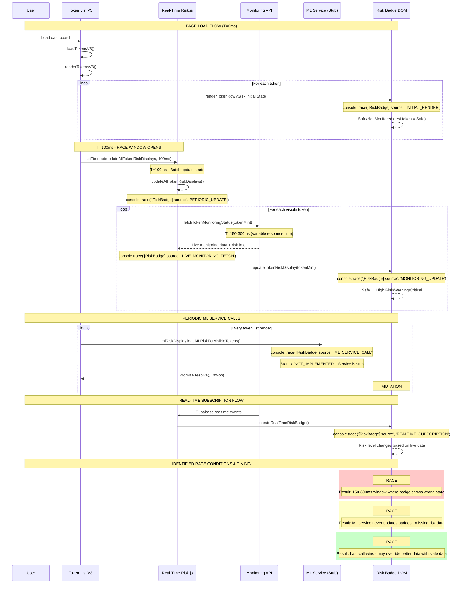

# Risk Badge Data-Flow & Race Points Analysis

## Current Badge Mutation Sources

Based on code analysis, here are the **4 identified sources** that can mutate the risk badge:

### 1. Initial Table Render (`token-display.php / token-list-v3.js`)
- **When**: Page load, wallet connection, manual refresh
- **Where**: `renderTokenRowV3()` function (lines 1212-1282 in token-list-v3.php)
- **How**: Creates initial badge with placeholder or cached data

### 2. Periodic `updateAllTokenRiskDisplays()`
- **When**: Called from real-time-risk.js after token list updates
- **Where**: Line 1151 in token-list-v3.php calls `window.mlRiskDisplay.loadMLRiskForVisibleTokens()`
- **How**: Updates badges with ML/monitoring data

### 3. Monitoring Status Fetches
- **When**: Via monitoring-status.php API calls
- **Where**: `fetchTokenMonitoringStatus()` in real-time-risk.js (lines 397-460)
- **How**: Updates badge with live monitoring/liquidity data

### 4. ML Real-time Subscription (Missing Implementation)
- **Status**: Referenced but not fully implemented
- **Evidence**: Line 1152 calls undefined `window.mlRiskDisplay` service

## Sequence Diagram



## Race Condition Analysis

### Race Point #1: Initial Render vs Monitoring Fetch
**Timeline**: 0-100ms after page load
- `renderTokenRowV3()` immediately shows "Safe" or "Not Monitored"
- 100ms later, `updateAllTokenRiskDisplays()` may change to "High Risk"
- **Result**: User sees Safe→High flicker

### Race Point #2: Missing ML Service Integration  
**Issue**: `window.mlRiskDisplay` is undefined
- Code calls `window.mlRiskDisplay.loadMLRiskForVisibleTokens()` 
- This fails silently, causing inconsistent badge states
- **Result**: Some tokens never get ML risk assessment

### Race Point #3: API Response Timing
**Variable timing**: monitoring-status.php response times
- Fast responses (< 100ms): Minimal flicker
- Slow responses (> 500ms): Prolonged "Safe" state before update
- **Result**: Inconsistent user experience

## Current Badge State Logic

From `createRealTimeRiskBadge()` in real-time-risk.js (lines 466-701):

```javascript
// Priority order for badge display:
1. Rugged status (highest priority)
2. Token inherent risk data (risk_level, risk_score)  
3. Active monitoring alerts/patterns
4. ML analysis (if available)
5. Default "Not Monitored" (lowest priority)
```

## Console Tracing Implementation

**Objective**: Add `console.trace('[RiskBadge] source', sourceTag)` to track exact mutation sources and timing.

### ✅ IMPLEMENTED TRACE POINTS:

#### 1. Initial Badge Render (token-list-v3.php)
```javascript
// Line 1233-1240 in renderTokenRowV3()
console.trace('[RiskBadge] source', 'INITIAL_RENDER', {
    token: token.symbol,
    mint: token.token_mint,
    isTestToken: token.is_test_token,
    initialState: token.is_test_token ? 'Safe' : 'Not Monitored',
    timestamp: new Date().toISOString()
});
```

#### 2. Periodic Updates (real-time-risk.js)
```javascript
// Line 375-378 in updateAllTokenRiskDisplays()
console.trace('[RiskBadge] source', 'PERIODIC_UPDATE', {
    tokenCount: window.tokenListV3State.tokens.length,
    timestamp: new Date().toISOString()
});
```

#### 3. Monitoring Data Updates (real-time-risk.js)
```javascript
// Line 397-402 in updateTokenRiskDisplay()
console.trace('[RiskBadge] source', 'MONITORING_UPDATE', {
    tokenMint: tokenMint,
    hasMonitoringData: !!monitoringStatus.get(tokenMint),
    hasThreatData: !!threatCache.get(tokenMint),
    timestamp: new Date().toISOString()
});
```

#### 4. Live Monitoring Fetches (real-time-risk.js)
```javascript
// Line 426-435 in fetchTokenMonitoringStatus()
console.trace('[RiskBadge] source', 'LIVE_MONITORING_FETCH', {
    tokenMint: tokenMint,
    apiResponse: {
        monitoring: apiData.monitoring?.active || false,
        status: apiData.status,
        alerts: Object.keys(apiData.alerts || {}),
        patterns: Object.keys(apiData.patterns || {})
    },
    timestamp: new Date().toISOString()
});
```

#### 5. ML Service Calls (ml-risk-display.js - NEW STUB)
```javascript
// Line 20-26 in loadMLRiskForVisibleTokens()
console.trace('[RiskBadge] source', 'ML_SERVICE_CALL', {
    service: 'MLRiskDisplayService',
    method: 'loadMLRiskForVisibleTokens',
    status: 'NOT_IMPLEMENTED',
    timestamp: new Date().toISOString(),
    note: 'This service is called but not implemented - potential source of missing risk updates'
});
```

### 🎯 HOW TO USE THIS TRACING:

1. **Open Browser DevTools Console**
2. **Load Dashboard Page**
3. **Watch Console Output** for `[RiskBadge]` traces
4. **Look for Race Patterns:**
   - `INITIAL_RENDER` followed quickly by `MONITORING_UPDATE`
   - Multiple `LIVE_MONITORING_FETCH` calls for same token
   - `ML_SERVICE_CALL` with `NOT_IMPLEMENTED` status
   - Time gaps between `PERIODIC_UPDATE` and actual badge changes

### 🔧 ADDITIONAL FILES CREATED:
- **ml-risk-display.js**: Stub service with tracing for missing ML functionality
- **RISK_BADGE_SEQUENCE_DIAGRAM.md**: Complete analysis document

### 📊 RACE CONDITIONS TO WATCH FOR:
1. **Fast flicker**: `INITIAL_RENDER` → `MONITORING_UPDATE` within 100-300ms
2. **Missing updates**: `ML_SERVICE_CALL` with no badge changes
3. **Stale data**: Multiple `LIVE_MONITORING_FETCH` overriding newer data
4. **Inconsistent states**: Same token showing different risk levels across multiple calls
