# PanicSwap User Flow Sequence Diagrams

## 1. "Start Demo" Flow - From User Input to Token Appearing in Wallet List

```mermaid
sequenceDiagram
    participant U as User
    participant D as DOM
    participant LS as LocalStorage
    participant JS as JavaScript
    participant PF as PumpFun API
    participant H as Helius API
    participant J as Jupiter API
    participant SB as Supabase
    participant TL as Token List Component

    Note over U,TL: Demo Token Addition Flow
    
    U->>D: Enters token mint in #demo-token-input
    U->>D: Clicks "Start Demo" button
    D->>JS: onclick="startDemo(event)"
    
    Note over JS: demo-mode.js processes input
    JS->>LS: Read walletAddress from localStorage
    alt Wallet not connected
        JS->>D: DOM Mutation: Show error notification
        JS-->>U: "Please connect wallet first"
    else Wallet connected
        Note over JS: Validate token mint address format
        
        Note over JS,PF: Network Request Chain - Token Data Fetching
        JS->>PF: POST https://pumpfun-scraper-api.p.rapidapi.com/search_tokens
        Note over PF: Headers: x-rapidapi-key, x-rapidapi-host
        PF-->>JS: JSON response with token metadata
        
        alt PumpFun API fails
            JS->>H: POST https://mainnet.helius-rpc.com/?api-key={key}
            Note over H: getAsset method for token metadata
            H-->>JS: JSON response with basic metadata
            
            JS->>J: GET https://price.jup.ag/v6/price?ids={mint}
            Note over J: Price and market data
            J-->>JS: JSON response with pricing data
        end
        
        Note over JS: Combine metadata from all sources
        
        Note over JS,SB: Supabase Database Operations
        JS->>SB: INSERT into token_metadata table
        Note over SB: Store: mint, symbol, name, image, decimals, price
        SB-->>JS: Success confirmation
        
        JS->>SB: INSERT into user_tokens table  
        Note over SB: Link token to wallet: wallet_address, token_mint
        SB-->>JS: Success confirmation
        
        Note over JS: Real-time subscription triggers
        SB-->>TL: Real-time update via postgres_changes subscription
        Note over TL: token-list-v3.js receives update
        
        TL->>LS: Write token data to localStorage cache
        TL->>D: DOM Mutation: Add new row to #token-list-tbody-v3
        Note over D: New token row appears with balance, price, protect button
        
        TL->>D: DOM Mutation: Update #total-value-v3 display
        TL->>D: DOM Mutation: Flash animation on new row
        Note over D: Green flash animation indicates successful addition
        
        JS->>D: DOM Mutation: Show success notification
        JS-->>U: "Token added successfully! 🎉"
    end
```

## 2. Auto-Protect Toggle Flow - Enabling, Disabling, Real-time Sync

## 3. Manual Protect/Unprotect Button Per Token Flow

## 4. Risk Badge Live Update and Tooltip Display Flow

## Key Technical Implementation Details

### Network Requests Highlighted:
- **PumpFun API**: Token metadata fetching with RapidAPI authentication
- **Helius RPC**: Fallback token metadata via getAsset method  
- **Jupiter API**: Real-time price data fetching
- **Protection APIs**: RESTful endpoints for protect/unprotect operations
- **Monitoring APIs**: Real-time status and threat detection data
- **Supabase**: Database operations via REST API and real-time subscriptions

### Local Storage Operations:
- **walletAddress**: User's connected wallet address
- **autoProtectEnabled**: Auto-protect toggle state persistence
- **tokenListV3State**: Cached token data and recent changes tracking
- **defaultMempoolSettings**: User's mempool monitoring preferences

### Supabase Real-time Subscriptions:
- **protected_tokens**: Protection status changes
- **pattern_alerts**: Threat detection alerts  
- **token_price_history**: Price movement tracking
- **protection_alerts**: System-generated warnings
- **wallet_auto_protection**: Auto-protect configuration changes

### DOM Mutations:
- **Loading States**: Spinners, disabled buttons, opacity changes
- **Visual Feedback**: Color changes, animations, badge updates
- **Data Updates**: Token counts, prices, protection status
- **Notifications**: Success/error messages, tooltips, alerts
- **Real-time Indicators**: Pulse animations, status badges, monitoring indicators

Each flow demonstrates the complex interaction between frontend optimistic updates, backend API calls, database changes, and real-time synchronization that provides users with immediate feedback while ensuring data consistency across the system.
