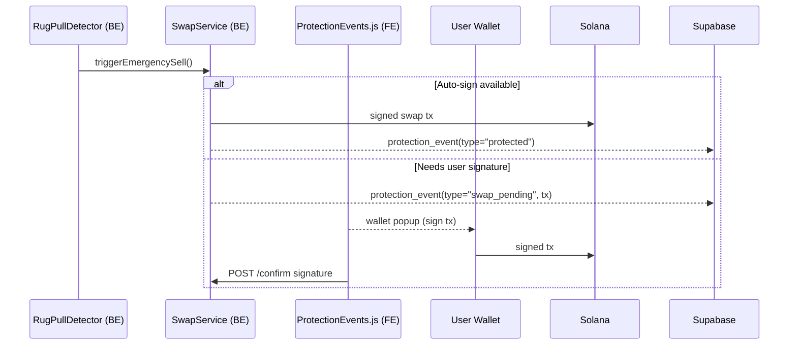

# PanicSwap Wallet Refactor Plan

## Project Summary
PanicSwap currently relies on user signatures to execute emergency swaps when a token rug pull is detected. Our goal is to extend the wallet flow so that:
1. **If the user explicitly opts-in**, the backend can sign and send the swap automatically using either a delegate allowance or a user-supplied hot-wallet key (stored securely server-side).
2. **Otherwise** the system falls back to today's flow—building an unsigned swap transaction and asking the user's wallet to approve it.

This refactor touches both the frontend (new wallet settings UI, realtime event listener, wallet adapter helpers) and the backend (new endpoints and event payloads). Security is paramount: seed phrases never remain in the browser, and all automated signing requires explicit user consent.

## 1. Objectives

1. Support *two* swap-execution paths after a rug-pull trigger:
   • **Auto-sign path** – backend already holds signing authority (hot-key or
     delegate) and executes without any front-end involvement.
   • **User-sign path** – backend returns a base-64 serialized transaction that
     the front-end passes to the user's wallet for manual approval.
2. Give users an in-app settings panel to opt-in/out of "Auto-Sell (Beta)".
3. Keep seed phrases/private keys **out of** browser storage; if the user
   chooses hot-wallet mode we hand the key straight to the backend over HTTPS
   and *never* persist it in `localStorage`.
4. Maintain backward compatibility with existing manual features (connect,
   balance display, manual swap, etc.).

---

## 2. Target Front-End Files

| File | Action |
|------|--------|
| `assets/js/wallet-adapter.js` | 1. expose new `signAndSendRawTransaction(serialized)` helper  <br>2. export singleton instance so other modules can import without newing. |
| `assets/js/protection-events.js` *(new)* | Encapsulate Supabase realtime channel subscription and route events to callbacks. |
| `assets/js/auto-sell.js` *(new)* | Handles the opt-in workflow, communicates with backend `/api/auto-sell/*` endpoints, stores the *status flag* (not the key) in `localStorage`. |
| `assets/js/main.js` | a. import the two new modules. <br>b. on `protection_swap_pending` event call `walletAdapter.signAndSendRawTransaction(tx)` and POST the resulting signature back to `/api/protection/swap/confirm`. |
| `components/header.php` | Add "Wallet Settings" gear-icon that opens a modal. |
| `components/wallet-settings-modal.php` *(new)* | Modal HTML for Auto-Sell toggle, delegate setup wizard, hot-wallet key input. |

---

## 3. High-Level Flow



---

## 4. Detailed Steps

### 4.1 Wallet Adapter Enhancements (`assets/js/wallet-adapter.js`)
1. Convert to *singleton* pattern:
   ```js
   const walletAdapter = new WalletAdapter();
   export default walletAdapter;
   ```
2. Add helper:
   ```js
   async function signAndSendRawTransaction(base64Tx) {
       const tx = solanaWeb3.Transaction.from(Buffer.from(base64Tx, 'base64'));
       const { signature } = await this.signAndSendTransaction(tx);
       return signature;
   }
   ```
3. Re-export this helper.

### 4.2 Protection Events Module (`assets/js/protection-events.js`)
*Subscribes to Supabase `protection_events` channel.*
```js
import { createClient } from "https://cdn.jsdelivr.net/npm/@supabase/supabase-js/+esm";
import walletAdapter from './wallet-adapter.js';

const supabase = createClient(SB_URL, SB_ANON);

export function initProtectionChannel(walletAddress) {
  return supabase.channel(`protection:${walletAddress}`)
    .on('postgres_changes', { event: '*', schema: 'public', table: 'protection_events', filter: `wallet_address=eq.${walletAddress}` }, async payload => {
        const evt = payload.new;
        if (evt.event_type === 'swap_pending') {
           const sig = await walletAdapter.signAndSendRawTransaction(evt.event_data.serialized_tx);
           await fetch(`/PanicSwap-php/api/protection/swap/confirm`, {
              method: 'POST',
              headers: { 'Content-Type': 'application/json' },
              body: JSON.stringify({ signature: sig, id: evt.id })
           });
        }
    })
    .subscribe();
}
```

### 4.3 Auto-Sell Opt-In (`assets/js/auto-sell.js`)
1. UI flow inside `wallet-settings-modal.php`.
2. When user toggles **ON**:
   * Present two options: *Hot-Wallet* or *Delegate*.
   * Hot-Wallet: textarea for base-58 secret key ➔ POST `/api/auto-sell/hot-wallet` → backend encrypts & stores.
   * Delegate: call backend to build `Approve` tx → `walletAdapter.signAndSendRawTransaction`.
3. Save `{ autoSellEnabled:true, mode:"hot" }` in `localStorage` for UX only.

### 4.4 Main JS Changes
* At login / wallet-connect, call `initProtectionChannel(publicKey)`.
* Add graceful fallback: if channel not ready, queue notifications.

---

## 5. Backend Touchpoints (for coordination)
* `POST /api/auto-sell/hot-wallet` – store encrypted private key (out-of-scope for FE).
* `POST /api/auto-sell/delegate` – returns serialized `Approve` tx.
* `POST /api/protection/swap/confirm` – receives user-signed signature to mark swap as *confirmed*.
* Existing `protection_events` row with `event_type='swap_pending'` must include `{ serialized_tx }`.

---

## 6. Security Notes
1. Never cache secret keys in browser storage.
2. Always use `window.crypto.getRandomValues` for CSRF tokens in modal POSTs.
3. Display a BIG warning when user enters a hot-wallet key.
4. Use `target="_blank" rel="noopener noreferrer"` for external links to wallet help pages.

---

## 7. Rollout / Migration
1. Implement backend endpoints behind a feature flag (`AUTO_SELL_BETA`).
2. Deploy front-end changes but keep toggle hidden until backend ready.
3. Run end-to-end tests on devnet with throwaway wallets.
4. Announce beta opt-in to power users.

---

## 8. Acceptance Tests
- [ ] User with *auto-sell off* gets a wallet popup when rug detected and the swap executes after approval.
- [ ] User with *hot-wallet mode* sees no popup; dashboard shows "Protected!" instantly.
- [ ] Delegate mode successfully swaps without revealing key.
- [ ] Regression: normal browsing speed & bundle size unaffected (< +15 KB gzipped).

---

*Author: AI-generated plan – 2025-06-20* 